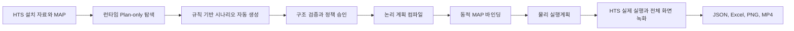

# 시나리오 테스트 파이프라인

## 한눈에 보기



기본 경로에는 외부 LLM이 없다. 프로그램이 MAP의 컨트롤 역할·이벤트·공식 선택지와 현재 HTS에서 Plan-only로 수집한 런타임 컨트롤·콤보·라디오·탭 선택지를 결합한다. 사용자 데이터셋 값을 먼저 반영하고 미지정 값은 날짜·문자 경계값과 설치 자료로 보충한다. 서로 다른 컨트롤의 전역 카테시안 곱은 만들지 않고, 컨트롤별 전수 선택으로 케이스 폭증을 제한한다.

실제 HTS 조작은 현재 설치본의 MAP 컨트롤이 런타임 HWND와 높은 신뢰도로 결합된 사례만 수행한다. 종료 컨트롤과 HTS 외부 파일 저장 창을 열 수 있는 내보내기 컨트롤은 자동 실행에서 제외하고 승인 문서에 커버리지 공백으로 남긴다.

`autoExploration.interactionStrategy`가 `RuntimeTabOrder`이면 실제 탭 순회 결과로 실행 순서를 정한다. `CoordinateFocus`이면 시나리오 순서를 유지하고 내부화면코드·컨트롤 ID·상태 컨텍스트로 고정한 MAP+Runtime 좌표를 매 단계 다시 검증한 뒤 클릭해 포커스하고 조작한다. 좌표가 화면 경계를 벗어나거나 대상 HWND·포커스를 확인하지 못하면 입력을 보내지 않는다. 0101 주문 화면은 `CoordinateFocus`를 사용한다.

## 자동 전체 실행

로그인된 HTS를 둔 뒤 다음 명령 하나를 실행한다. 일반 PowerShell이면 한 번의 UAC 승인으로 전체 스크립트를 관리자 권한에서 이어 실행한다.

```powershell
powershell -NoProfile -ExecutionPolicy Bypass -File .\scripts\run-auto-scenario-pipeline.ps1 -AllowElevatedActionPrompt
```

순서는 다음과 같다.

1. 데이터셋 `targetProfile.map`에서 대상 MAP과 설치 카탈로그를 추출한다.
2. 일반 Plan-only로 화면을 순회해 런타임 컨트롤과 선택 항목을 수집한다. `RuntimeTabOrder` 전략에서만 활성 탭오더를 실행 순서 근거로 사용한다.
3. `RuleScenarioGenerator`가 MAP·런타임 계획·데이터셋에서 시나리오를 생성한다.
4. 검증기가 날짜 형식, 값 참조, 화면 범위, 중복 ID와 케이스 상한을 검사한다.
5. `RuleScenarioAutoApprovalPolicy`가 현재 자동 생성기 서명이 있고 필수 검토 항목이 없는 문서만 승인한다.
6. 컴파일러가 시나리오가 참조한 값만 확장해 논리 계획을 만든다.
7. 같은 Plan-only 결과로 MAP logicalName을 실제 컨트롤에 바인딩하고 물리 계획을 만든다.
8. 물리 계획이 `READY`일 때만 녹화 실행기로 실제 시나리오 동작을 수행한다.
9. JSON, 오류 PNG, 전체 HTS 창 MP4와 한국어 Excel을 생성한다.

주요 산출물은 한 실행 폴더 아래의 `map-catalog.json`, `runtime-discovery\control-plan.json`, `generated-rule-scenarios.json`, `scenario-validation.json`, `automatic-approval.json`, `compiled-plan.json`, `binding-catalog.json`, `physical-plan.json`, `recorded-run`이다. 단계 상태는 `자동파이프라인-상태.json`에 기록된다.

HTS를 전혀 조작하지 않고 생성기만 검증하려면 다음 명령을 사용한다.

```powershell
powershell -NoProfile -ExecutionPolicy Bypass -File .\scripts\run-auto-scenario-pipeline.ps1 `
  -StaticOnly -ReferenceDate 20260810
```

동적 바인딩까지 수행하되 실제 시나리오 입력·선택·클릭은 하지 않으려면 `-PrepareOnly`를 사용한다. 두 모드는 실행하지 않은 제품 결과를 `PASS`로 만들지 않고 `PENDING`으로 기록한다.

## 데이터 추가와 자동 반영

실행에 사용하는 `dataset.json`의 `variables[]`에 값을 추가한다. `name` 또는 `targetRole`을 대상 MAP 컨트롤의 `logicalName`과 같게 지정하고 `appliesToScreens`에 화면 ID를 넣으면 다음 자동 생성에서 사용자 값이 가장 먼저 반영된다. 공식 MAP 선택지와 런타임 선택지는 뒤에 자동 보충된다.

- 날짜: `controlKind: Date`, 값은 `yyyyMMdd`
- 체크박스: `valueMatch: Checked`, 값은 문자열 `true`와 `false`
- 콤보·라디오·탭: `valueMatch: DisplayText`, `Index` 또는 `Value`
- 기대값: 필요한 경우에만 `expectedOutcome`을 명시하며 데이터셋 계약이 자동 추론보다 우선한다.

## 선택적 외부 시나리오 경로

프로그램 규칙만으로 표현하기 어려운 업무 특화 흐름은 기존 ChatGPT 요청·수입 경로로 확장할 수 있다. 외부 결과는 실행 명령이 아니라 후보 시나리오이며 자동 정책 승인 대상이 아니다. 사람이 승인 오버레이를 완성해야 한다.

### 1. 요청자료 생성

```powershell
powershell -NoProfile -ExecutionPolicy Bypass -File .\scripts\invoke-scenario-pipeline.ps1 `
  -Stage RequestPackage
```

출력 폴더의 `request-package\01_ChatGPT_요청문.md`와 관련 JSON·Schema를 ChatGPT에 전달한다. 이 단계는 HTS를 조작하지 않으며 결과는 `PENDING`이다.

### 2. 반환 JSON 반입과 정적 Plan-only

```powershell
powershell -NoProfile -ExecutionPolicy Bypass -File .\scripts\invoke-scenario-pipeline.ps1 `
  -Stage ImportAndPlan `
  -GeneratedScenarioPath "$env:USERPROFILE\Downloads\generated-scenarios.json"
```

생성 파일의 구조, 화면번호, 논리 컨트롤명, 값 참조, 날짜 형식, 기대 결과를 검증한다. 컴파일러는 각 시나리오가 실제로 참조하는 변수만 조합하여 논리 테스트 사례를 만든다. 이 단계도 HTS를 조작하지 않는다.

주요 산출물:

- `import\generated-scenarios.json`: 해시로 고정된 반입 원본
- `import\validation.json`: 오류·경고와 커버리지
- `import\approval.template.json`: 사람이 검토할 승인 초안
- `static-plan\compiled-plan.json`: 실행 전 논리 계획
- `static-plan\scenario-review-items.json`: 검토 항목
- `pipeline-state.json`: 다음 단계 입력 경로

### 3. 승인 오버레이

`approval.template.json`을 별도 승인 파일로 복제해 검토 결과를 기록한다. 원본 시나리오 JSON은 수정하지 않는다.

- 최상위 `status`: 실행 결정을 활성화하려면 `Approved`
- `approvedBy`: 승인자 식별값
- `approvedAt`: ISO 8601 승인시각
- 필수 검토 `decision`: `Resolved`, `AcceptedGap`, `Deferred`, `Informational`
- 수동 시나리오 `decision`: `Approve`, `Reject`, `Deferred`
- 커버리지 공백 `decision`: `Resolved`, `AcceptedGap`, `Deferred`

`Approved`인데 승인자나 승인시각이 없거나, 원본 SHA-256이 다르거나, 허용되지 않은 결정값이 있으면 컴파일이 중단된다. 원본의 모든 검토 항목·수동 시나리오·커버리지 공백에 결정이 있어야 하며 `Deferred`가 남아 있어도 안 된다. `Draft` 상태에서는 안쪽에 `Approve`가 적혀 있어도 실행 승인으로 사용하지 않는다.

승인 파일을 적용해 논리 계획을 다시 만들려면 다음과 같이 실행한다.

```powershell
powershell -NoProfile -ExecutionPolicy Bypass -File .\scripts\invoke-scenario-pipeline.ps1 `
  -Stage ImportAndPlan `
  -GeneratedScenarioPath '.\data\scenarios\inbox\<generationId>\generated-scenarios.json' `
  -ApprovalPath '.\data\scenarios\approvals\<generationId>.approval.json'
```

### 4. 동적 MAP 바인딩 Plan-only

```powershell
powershell -NoProfile -ExecutionPolicy Bypass -File .\scripts\invoke-scenario-pipeline.ps1 `
  -Stage BindingPlan `
  -CompiledPlanPath '.\artifacts\scenario-pipeline\...\static-plan\compiled-plan.json'
```

이 단계는 HTS 화면을 순서대로 열어 컨트롤을 발견하지만 시나리오 입력·선택·클릭 단계는 실행하지 않는다. 설치 fingerprint가 요청자료 생성 당시와 같은지 확인하고, `MAP+Runtime`, 안정된 locator, 조작 종류 호환, 유효 좌표, 24px 이하 거리 조건을 모두 만족하는 유일한 후보만 `BoundHigh`와 `executionEligible=true`로 판정한다.

주요 산출물은 스키마 `1.1`의 `binding-catalog.json`, 시나리오별 후보 identity를 `resolvedBindings`에 고정한 `physical-plan.json`, `binding-plan-summary.json`이다. 모든 승인과 필수 바인딩을 통과해야 물리 계획이 `READY`가 된다.

### 5. 실제 실행과 녹화

```powershell
powershell -NoProfile -ExecutionPolicy Bypass -File .\scripts\invoke-scenario-pipeline.ps1 `
  -Stage Execute `
  -CompiledPlanPath '.\artifacts\scenario-pipeline\...\static-plan\compiled-plan.json' `
  -PhysicalPlanPath '.\artifacts\scenario-pipeline\...\binding-plan\physical-plan.json' `
  -AllowElevatedActionPrompt
```

기본값은 물리 계획 전체가 `READY`가 아니면 실제 조작을 거부한다. 실행 전 카탈로그 파일 해시와 계획 스키마를 검사하며, 매 단계 직전에 `resolvedBindings`의 `controlId`, `locatorSignature`, 내부화면코드, 상태 컨텍스트로 유일 후보를 다시 확인한다. identity가 바뀌면 입력을 보내지 않고 자동화 계약 `ERROR`로 분리한다. `CoordinateFocus` 단계는 물리 좌표·대상 화면·전경 창을 확인한 뒤 `SendInput`으로 클릭하고, 텍스트·날짜 입력은 포커스가 대상 화면 내부에 남았음을 확인한 뒤에만 값을 보낸다.

실행기는 같은 화면의 여러 사례를 처리할 때 화면을 다시 열지 않고 유지하며, 해당 화면의 마지막 사례가 끝난 뒤에만 닫는다. 시나리오 단계만 조작하고, 입력 단계의 조회 요구는 뒤의 명시적 조회 단계까지 추적한 뒤 최종 판정한다.

녹화는 HTS 메인 창 전체를 대상으로 하며, 결과 폴더에는 `full-run.mp4`, JSON 결과, 오류 스크린샷, Excel 보고서가 생성된다. 녹화·보고서 생성 완료와 테스트 판정을 분리해 `DONE`, `DONE_WITH_TEST_FAILURES`, `DONE_WITH_TEST_ERRORS`, `DONE_WITH_PENDING`으로 기록한다.

## 현재 검증 상태

2026-08-10의 특정 화면군 전용 정적 결과는 범용화 이전 참고 기록이다. 현재 `targetProfile` 기반 코드의 동적 바인딩, 실제 조작과 전체 창 녹화는 다시 수행해야 하므로 `PENDING`이다.

기존 외부 `generated-scenarios.json`은 현재 대상 프로필·계획 해시와 연결되지 않아 실행 입력으로 사용하지 않는다. 대용량 생성물 정리 승인 후 함께 삭제하며, 외부 시나리오는 새 대상 데이터셋으로 다시 생성하고 사람 승인 전에는 자동 실행하지 않는다.
